# Project 2
## TweetAPI:
Before run this python file, make sure you have the latest version of python. Also, you need to have Twitter develop account and relavent key to access twitter API.
I store my key locally and load it when I run this program. If you want to use your own config, please name your file "config.py" and use the following format.
```python
consumer_key = " "
consumer_secret = " "
```

To run this program, use terminal to run this line
python TweetAPI.py

# function:
**update_own_status:  **
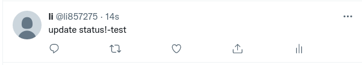
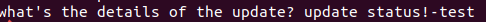

**retweet:  **


**get status:  **
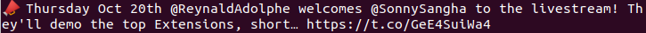

**my timeline:  **
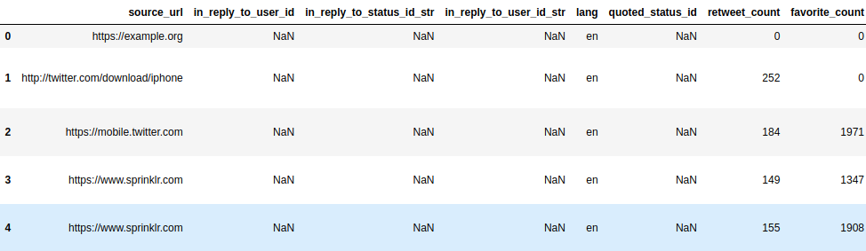
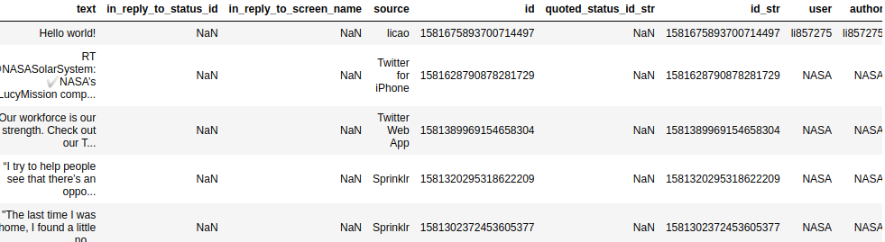

**user timeline:  **
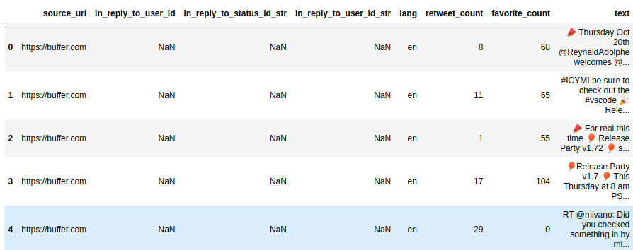
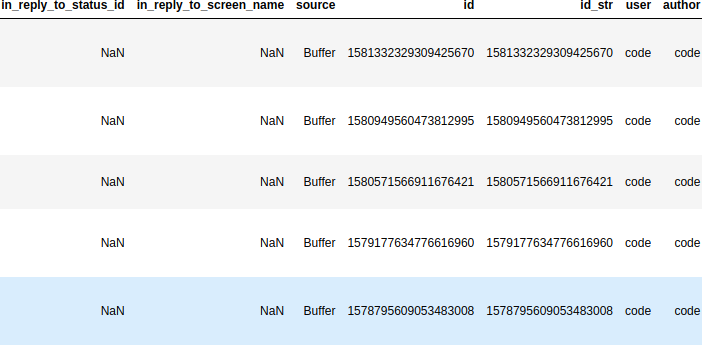
## Google nlp

Import a sentiment dataset, training and predict our target context (1 represents positive and 0 represents negative).   
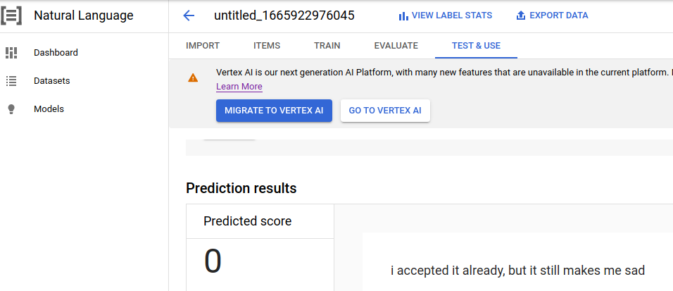
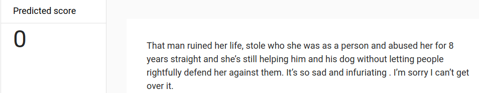
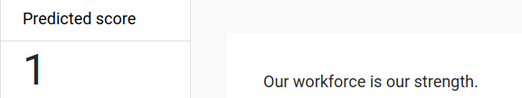
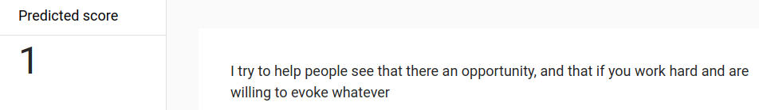


